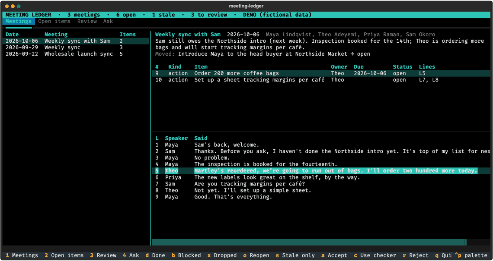
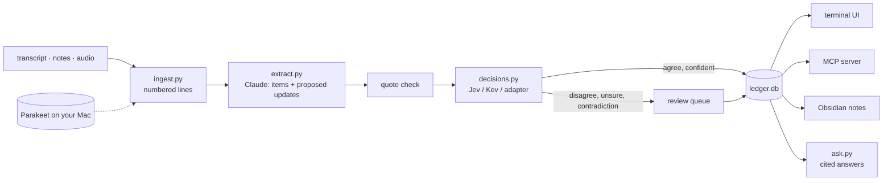

# meeting-ledger

**Your meetings, on the record: who decided what, who promised what, and whether it happened.**

Feed it a transcript, your notes or the recording itself. It pulls out the decisions, action
items, promises and open questions, each one pinned to the transcript lines it came from. Then it
keeps track of them: when a later meeting finishes, blocks or reverses something, the ledger
updates. When a promise stops coming up even though the person who made it keeps showing up, it
flags it as **stale**.

[](https://github.com/owen-alderson/meeting-ledger/actions/workflows/ci.yml)
[](https://pypi.org/project/meeting-ledger/)




<sub>Fictional demo data: try it yourself with `meeting-ledger demo`, no API key needed.</sub>

## Why

Note-takers summarise one meeting at a time. The things that slip happen *between* meetings: "I'll
send the invoice" is said once and never comes up again, a decision quietly gets reversed two weeks
later, a task gets "assigned" to someone who never actually agreed to it.

meeting-ledger splits the work three ways:

| | Who | What |
|---|---|---|
| **Extracts** | Claude (`claude-opus-5-5`) | Reads the numbered transcript and lists every decision, action, commitment and open question, each citing the lines that support it. Also proposes which earlier open items this meeting moved on. |
| **Checks** | A *System One* decision model: [Jev](https://typesafe.ai/blog/introducing-system-one-models-and-jev), or [Kev](https://github.com/jaredpalmer/kev), its open-source twin running on your own machine | Typed, calibrated answers: do the cited lines really support this item? Did the owner actually agree to it? Independently of Claude, what do these new lines say about that earlier item: done, blocked, dropped, contradicted? |
| **Reviews** | You | Anything the two models disagree on, or the checker isn't confident about, waits for you instead of being guessed. |

There's also a plain check that needs no model at all: every quote must literally appear in the
lines it cites, or the item is flagged.

## What it does

- **Any input:** WebVTT/SRT exports from Zoom, Teams or Meet, plain text or Markdown notes with or
  without `Name:` speaker labels, or an audio/video file transcribed **on your Mac** with
  [Parakeet](https://github.com/senstella/parakeet-mlx), so the recording never leaves the machine.
- **Cited items:** every item lists its transcript lines (`L12`). In the terminal UI, moving to an
  item highlights and scrolls to those lines.
- **Follow-through across meetings:**
  - When a later meeting mentions an earlier item, Claude proposes a status and the decision model
    checks it. If both agree with ≥ 70 % confidence, the change is applied and logged with the line
    that justified it. Otherwise it goes to review.
  - Contradictions (a reversed decision, a withdrawn promise) always go to review.
  - Items whose owner attended but nobody mentioned count a miss. Two misses (configurable) and the
    item is **stale**.
- **Ask your meetings:** `meeting-ledger ask "what did we decide about the online shop?"` finds the
  matching lines across every meeting and gets Claude to answer with real citations
  ([search-result blocks](https://platform.claude.com/docs/en/build-with-claude/search-results)),
  so each sentence points to a meeting and its lines.
- **Terminal UI:** meetings, open items, the review queue and ask, in one keyboard-driven screen.
- **MCP server:** Claude Desktop, Claude Code or any MCP client can search your meetings and list
  or update open items.
- **Obsidian:** each meeting becomes a note with YAML frontmatter, a checklist, line references,
  the transcript, and `[[wikilinks]]` to people who already have a note in your vault.

## Quickstart

```bash
pipx install meeting-ledger
meeting-ledger demo            # the terminal UI on fictional meetings, no key needed
```

With your own meetings:

```bash
echo 'ANTHROPIC_API_KEY=sk-ant-...' >> ~/.meeting-ledger/.env

meeting-ledger add "standup 2026-10-07.vtt"   # the date comes from the file name, or --date
meeting-ledger add notes.txt --title "Board call" -o board-call.md
pbpaste | meeting-ledger add -                # paste notes
meeting-ledger                                # open the terminal UI
```

Audio and video (Apple Silicon; needs `brew install ffmpeg`):

```bash
pipx install 'meeting-ledger[audio]'
meeting-ledger add call.m4a
```

Everything else is a command too:

| Command | |
|---|---|
| `meeting-ledger items [--owner NAME] [--stale]` | Open actions, commitments and questions |
| `meeting-ledger show [ID]` | List meetings, or print one as Markdown |
| `meeting-ledger ask QUESTION` | Answer from your meetings, with citations |
| `meeting-ledger review [ID proposed\|checked\|reject]` | See or settle what needs review |
| `meeting-ledger set ITEM STATUS` | `open`, `blocked`, `done`, `dropped` (decisions: `standing`, `reversed`) |
| `meeting-ledger export --all --vault ~/Obsidian` | Write meetings into a vault |
| `meeting-ledger mcp` | Run the MCP server over stdio |

Terminal UI keys: `1`–`4` switch tabs (Meetings, Open items, Review, Ask). On items: `d` done,
`b` blocked, `x` dropped, `o` reopen, `s` stale only, `Enter` opens the item's meeting. In
review: `a` accept, `c` use the checker's status, `r` reject.

## The decision model: Jev, Kev, or neither

Jev is a [System One model](https://typesafe.ai/blog/introducing-system-one-models-and-jev): you
ask typed questions (`Noul`: how likely is this statement to be true; `Choice`: which of these
labels), and each answer comes with a calibrated probability, typically in well under a second.
That's the right tool for *checking* Claude: fast, cheap, and honest about when it isn't sure.
meeting-ledger's questions are in [`decisions.py`](meeting_ledger/decisions.py).

Pick a backend with environment variables (in `~/.meeting-ledger/.env`):

| Backend | Setting | Notes |
|---|---|---|
| **Kev** (open weights, local) | `TYPESAFE_BASE_URL=http://127.0.0.1:8009` | Jared Palmer's [open-source Jev](https://github.com/jaredpalmer/kev) serves the same API, so the same TypeSafe SDK talks to it. Runs on Apple Silicon via MLX. |
| **Jev** (hosted) | `TYPESAFE_API_KEY=...` | TypeSafe's own model (early access). |
| **Neither** | nothing | TypeSafe's open-source [`system-one-adapter`](https://github.com/typesafe-ai/system-one-adapter-python) asks Claude Haiku 4.5 the same questions. Slower, but it works out of the box. |

Running Kev locally:

```bash
git clone https://github.com/jaredpalmer/kev && cd kev
uv sync --extra serve
uv run --extra serve python -m kev.serve --run jaredpalmer/kev-4b --port 8009   # kev-0.8b on a smaller Mac
```

Kev's own guidance: Kev-4B needs about 32 GB of memory and is much more accurate than Kev-0.8B,
which fits any Apple Silicon Mac.

Measured on an 18 GB M3 Pro with Kev-0.8B (October 2026), running the demo meetings: follow-up
checks took about 90 ms each and nothing was applied wrongly, but the model was rarely confident.
Most follow-up checks scored below the 70 % threshold, and it flagged two correct items as
unsupported. So with 0.8B the ledger still works, but most changes wait for you in review. For
changes to be applied automatically, use Kev-4B or larger, or Jev.

### What leaves your machine

| | Audio | Transcript text | Decision questions |
|---|---|---|---|
| Audio file + Kev | stays local (Parakeet) | sent to Anthropic for extraction | stays local (Kev) |
| Audio file + Jev | stays local | Anthropic | TypeSafe |
| Text file + no decision backend | – | Anthropic | Anthropic (Claude Haiku) |
| `ask` | – | the matching lines go to Anthropic | – |
| MCP server | – | to whichever MCP client you connect | – |

Your ledger itself is one SQLite file, `~/.meeting-ledger/ledger.db`.

## MCP

Add to Claude Desktop's `claude_desktop_config.json` (or `claude mcp add meeting-ledger -- meeting-ledger mcp` in Claude Code):

```json
{
  "mcpServers": {
    "meeting-ledger": { "command": "meeting-ledger", "args": ["mcp"] }
  }
}
```

Install with `pipx install 'meeting-ledger[mcp]'`. Tools: `search`, `meetings`, `meeting`,
`open_items` (filter by owner or stale) and `set_item_status`. The server needs no API key: your
MCP client's own model does the reasoning.

## How it works



[`ledger.py`](meeting_ledger/ledger.py) holds every rule (grounding, flags, when an update is
applied, staleness). Claude and the decision model are injected, so all of it is tested without a
network.

## Development

```bash
git clone https://github.com/owen-alderson/meeting-ledger && cd meeting-ledger
python -m venv .venv && . .venv/bin/activate
pip install -e '.[dev]'
pytest            # 160 tests, no network: Claude, Jev/Kev and Parakeet are faked
```

The Claude and TypeSafe tests run the real SDKs against a mocked HTTP transport, so the exact
request shapes are checked. Releases: push a `vX.Y.Z` tag and GitHub Actions publishes to PyPI.

The original single-file CLI is kept at tag
[`v1-cli`](https://github.com/owen-alderson/meeting-ledger/tree/v1-cli).

## License

MIT
